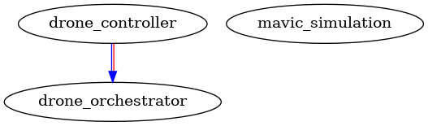

# AEROSCRIPT

 [](https://codecov.io/gh/siddhant-code/AeroScript) [](LICENSE)

A ROS2-based multi-drone coordination system that enables multiple drones to collaboratively write letters in the air using RVO (Reciprocal Velocity Obstacles) path planning. The system coordinates multiple drones through collision avoidance algorithms to achieve complex formation flying tasks.

https://github.com/user-attachments/assets/9c2d9d42-caf5-4f1a-95e9-cd3728ce0f5e


## Table of Contents

- [Overview](#overview)
- [Project Structure](#project-structure)
- [Prerequisites](#prerequisites)
- [Installation](#installation)
- [Building the Project](#building-the-project)
- [Running the System](#running-the-system)
- [Package Dependencies](#package-dependencies)
- [Troubleshooting](#troubleshooting)
- [Additional Documentation](#additional-documentation)
- [License](#license)
- [Authors](#authors)
- [Acknowledgments](#acknowledgments)


## Overview

This project implements a **Model-View-Controller (MVC)** architecture for coordinating multiple drones in a Webots simulation environment:

- **Model** = `drone_orchestrator` - Stand-alone C++ library implementing RVO-based path planning (see [src/drone_orchestrator/README.md](src/drone_orchestrator/README.md))
- **Controller** = `drone_controller` - ROS2 package that coordinates drone movements and handles letter writing sequences (see [src/drone_controller/README.md](src/drone_controller/README.md))
- **View** = `mavic_simulation` - Webots simulation environment with Mavic drone models

### Key Features

- **Multi-drone coordination** using RVO3D collision avoidance algorithm
- **Letter writing sequences** - Drones can form letters by following waypoint patterns from CSV files
- **Real-time path planning** - 125Hz control loop with collision-free velocity computation
- **ROS2 integration** - Full ROS2 Humble support with topic-based communication
- **Comprehensive testing** - Unit tests and integration tests with code coverage
- **Webots simulation** - Physics-based simulation environment

## Project Structure

```
aeroscript/
├── src/
│   ├── drone_orchestrator/     # C++ library (Model)
│   │   ├── include/            # Header files
│   │   ├── src/                # Source files
│   │   ├── test/               # Unit tests
│   │   └── CMakeLists.txt
│   ├── drone_controller/       # ROS2 package (Controller)
│   │   ├── src/                # Node source files
│   │   ├── test/               # Unit and integration tests
│   │   ├── launch/             # Launch files
│   │   └── CMakeLists.txt
│   ├── mavic_simulation/       # Webots simulation (View)
│   │   ├── mavic_simulation/   # Python package
│   │   ├── launch/             # Launch files
│   │   └── worlds/             # Webots world files
│   └── uml/                    # UML diagrams
├── build/                      # Build artifacts
├── install/                    # Installed packages
└── README.md                   # This file
```


## Prerequisites

### Required Software

- **ROS2 Humble** - [Installation Guide](https://docs.ros.org/en/humble/Installation.html)
- **CMake** 3.14 or higher
- **C++17** compatible compiler (GCC 9+ or Clang 10+)
- **Python 3.8+**
- **Webots R2025a** - [Download](https://cyberbotics.com/)

### Required ROS2 Packages

```bash
sudo apt update
sudo apt install -y \
    ros-humble-desktop \
    ros-humble-webots-ros2 \
    ros-${ROS_DISTRO}-catch-ros2 \
    libopencv-dev \
    doxygen \
    pandoc \
    graphviz
```

### Required System Libraries

- **RVO3D** - Reciprocal Velocity Obstacles library (installed via CMake)
- **OpenCV** - Computer vision library
- **GoogleTest** - Unit testing framework

## Installation

### 1. Clone the Repository

```bash
git clone https://github.com/siddhant-code/Aeroscript.git
cd draft_aero/ros2_ws_src/aeroscript
```

### 2. Install RVO3D Library

```bash
cd ~
git clone https://github.com/snape/RVO2-3D.git
cd RVO2-3D
mkdir build && cd build
cmake ..
make -j4
sudo make install
```

### 3. Source ROS2 Environment

```bash
source /opt/ros/humble/setup.bash
```

## Building the Project

### Build All Packages

```bash
# Clean previous builds (optional)
rm -rf build/ install/ ~/.cmake/packages/drone_orchestrator/

# Build all packages
colcon build --event-handlers console_cohesion+

# Source the workspace
source install/setup.bash
```

### Build Specific Package

```bash
# Build only drone_orchestrator
colcon build --packages-select drone_orchestrator

# Build only drone_controller (will also build dependencies)
colcon build --packages-select drone_controller
```

### Build with Verbose Output

```bash
VERBOSE=1 colcon build --event-handlers console_cohesion+
```

## Running the System

### 1. Run Webots Simulation

```bash
source install/setup.bash
ros2 launch mavic_simulation robot_launch.py text:=HI
```

This will:
- Launch Webots simulation with Mavic drones
- Start MavicDriver nodes for each drone
- Enable ROS2 topic communication

### 2. Launch Parameters

The launch file supports several parameters:

- **`text`** (default: `"HEY"`): Text string to be written by the drones
- **`record_bag`** (default: `false`): Enable/disable ROS2 bag recording
- **`bag_name`** (default: `"aeroscript_bag"`): Name of the bag file (without extension)

**Example with custom text:**
```bash
ros2 launch mavic_simulation robot_launch.py text:="HI"
```

**Example with all parameters:**
```bash
ros2 launch mavic_simulation robot_launch.py text:="HI" record_bag:=true bag_name:=my_test_run
```

<!-- ### 3. ROS2 Bag Recording

You can record all ROS topics during simulation for later analysis. The bag recording feature:

- Records all topics except camera topics (to reduce file size)
- Saves bags in the `results/` directory
- Automatically stops when the simulation exits

**Enable bag recording:**
```bash
ros2 launch mavic_simulation robot_launch.py record_bag:=true
```

**Custom bag name:**
```bash
ros2 launch mavic_simulation robot_launch.py record_bag:=true bag_name:=experiment_1
```

**With text parameter:**
```bash
ros2 launch mavic_simulation robot_launch.py text:="HELLO" record_bag:=true bag_name:=hello_test
```

The bag file will be saved in `results/<bag_name>/` directory. You can replay the bag later using:

```bash
ros2 bag play results/<bag_name>
```

**Note:** Camera topics are excluded from recording by default as they generate large amounts of data. If you need camera data, you can modify the launch file to remove the exclusion filter. -->

<!-- ## Testing

### Build Tests with Coverage

```bash
rm -rf build/ install/ ~/.cmake/packages/drone_orchestrator/
colcon build --cmake-args -DCOVERAGE=1 --event-handlers console_cohesion+
```

### Run All Tests

```bash
source install/setup.bash
colcon test --event-handlers console_direct+
```

### View Test Results

```bash
# Summary
colcon test-result

# Detailed output
colcon test-result --verbose
```

### Run Specific Test Packages

```bash
# Run drone_orchestrator unit tests only
colcon test --packages-select drone_orchestrator --event-handlers console_direct+

# Run drone_controller tests only
colcon test --packages-select drone_controller --event-handlers console_direct+
```

### Run Individual Test Executables

```bash
source install/setup.bash

# Unit tests
./build/drone_orchestrator/test/drone_orchestrator_tester
./build/drone_controller/helper_functions_test

# Integration tests (require ROS2 environment)
ros2 run drone_controller integration_test
ros2 run drone_controller subscriber_integration_test
``` -->
<!-- 
## Code Coverage Reports

### Generate Coverage Reports

After running tests with coverage enabled:

```bash
# Generate drone_controller coverage
ros2 run drone_controller generate_coverage_report.bash
open build/drone_controller/test_coverage/index.html

# Generate drone_orchestrator coverage
colcon build \
    --event-handlers console_cohesion+ \
    --packages-select drone_orchestrator \
    --cmake-target "test_coverage" \
    --cmake-arg -DUNIT_TEST_ALREADY_RUN=1
open build/drone_orchestrator/test_coverage/index.html
``` -->

## Package Dependencies

The system has the following dependency structure:

- `drone_controller` depends on:
  - `drone_orchestrator` (C++ library)
  - `rclcpp`, `std_msgs`, `geometry_msgs` (ROS2 packages)
  - `RVO3D` (external library)
  
- `drone_orchestrator` depends on:
  - `RVO3D` (external library)
  - `OpenCV` (external library)
  - `rclcpp` (ROS2 package)

- `mavic_simulation` depends on:
  - `webots_ros2` (ROS2 package)

## Troubleshooting

### CSV File Not Found Error

If you see `Could not open CSV: src/drone_controller/src/letters_AZ_cad.csv`, the listener node is looking for the CSV file in the wrong location. Ensure the CSV file exists at:
```
src/drone_controller/src/letters_AZ_cad.csv
```

### RVO3D Not Found

If CMake cannot find RVO3D:
```bash
# Verify installation
pkg-config --modversion RVO3D

# Reinstall if needed
cd ~/RVO2-3D/build
sudo make install
```

### Build Errors

If you encounter build errors:
```bash
# Clean everything and rebuild
rm -rf build/ install/ ~/.cmake/packages/drone_orchestrator/
colcon build --cmake-clean-cache
```

## Additional Documentation

Run the automated script that builds, tests, and generates combined coverage:

```bash
./do-tests-and-coverage.bash
```

This script:
1. Builds all packages with coverage enabled
2. Runs all tests
3. Generates individual coverage reports
4. Combines reports into a single HTML report
5. Opens the combined coverage report in a browser

### Generate Project Documentation

```bash
./do-docs.bash
```
This generates Doxygen documentation for all packages.

### View UML Diagrams

UML diagrams are available in `uml/` directory. To regenerate:

```bash
cd src/uml
java -jar plantuml.jar -tpng *.puml
```
Available diagrams: Class Diagram, Activity Diagram, Sequence Diagram, Component Diagram, Dependency Graph

### Generate Dependency Graph

```bash
colcon graph --dot | dot -Tpng -o depGraph.png
open depGraph.png
```



### Project Information: [Presentation Slides](https://drive.google.com/file/d/1zNXjDqU1kJnYIX05mbRUnIMJbgrn8LpH/view?usp=sharing)

## License

This project is licensed under the Apache 2.0 License - see the LICENSE file for details.

## Authors

Venkata Madhav Tadavarthi ([@madhav2133](https://madhav2133.github.io/)) and Siddhant Deshmukh ([@siddhanth](https://github.com/siddhant-code)). This project is conducted through three phases (Phase 0,1,2) and it involves Pair Programming among the two authors. 

## Acknowledgments

- RVO3D library: https://github.com/snape/RVO2-3D
- ROS2 Humble: https://docs.ros.org/en/humble/
- Webots: https://cyberbotics.com/
- Multi Drone launch: https://github.com/patrickpbarroso/drone-simulation.git
- Dr. Tommy Chang (Course Instructor - ENPM700), University of Maryland 